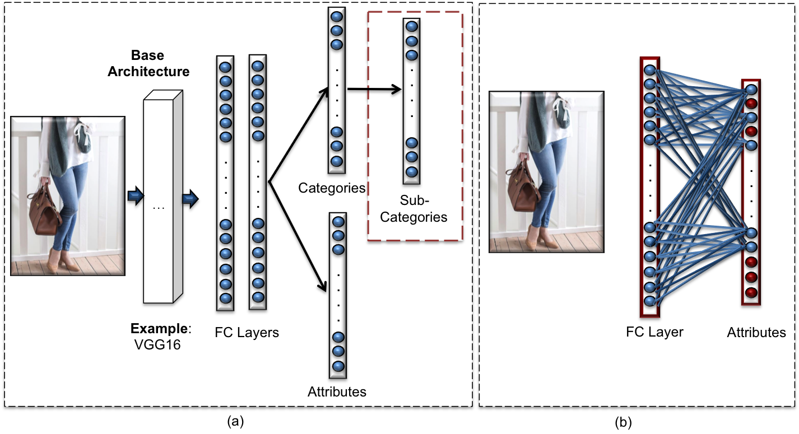

## Models

### Dynamic Pruning
The first method we propose is DynamicPruning. It can be described as an adaptive neural pruning (DynamicPruning) in which the clothing item  category  detected  from  posts’  text  analysis  can  be  used  to activate the possible range of connections of clothing attributes’ classifier. Below is an illustrative figure:

In this module, the related folder is: DynamicConnections. It contains implementation that supports the single class and the multi class scenarios. The implementation supports the VGG16 and ResNet archiectures. The single class scenarios were applied on the DeepFashion dataset and the multi class scenarios were applied on the Instagram Dataset. Full details of the algorithm is in Algorithm 1 in the paper
(Dynamic CNN Models for Fashion Recommendation in Instagram).

### Dynamic Layers
The second method that we propose is  a  dynamic framework in which multiple-attributes classification layers exist and a suitable attributes’ classifier layer is activated dynamically based upon the mined text from the image. It was also applied on the subcategories scenario. Below is an illustrative figure:

In this module, the related folder is: DynamicLayers. It contains implementation that supports the single class and the multi class scenarios. The implementation supports the VGG16 and ResNet archiectures. The single class scenarios were applied on the DeepFashion dataset and the multi class scenarios were applied on the Instagram Dataset. Full details of the algorithm is in Algorithm 2 in the paper
(Dynamic CNN Models for Fashion Recommendation in Instagram).

### Static
The Static module contains implementation for the base archiectures without dynamic connections or dynamic layers.

### Processing
This module contains two evaluators, one that works for the single-class and the other for the multi-class. Full details of the evaluation are available in the paper (Dynamic CNN Models for Fashion Recommendation in Instagram). 

